# 注塑企业论文知识库 Agent

一个面向注塑成型企业的 **RAG + Agent 论文知识库应用**。

项目以注塑成型相关学术论文为核心知识来源，支持工艺问答、缺陷诊断、工艺参数影响分析、论文方法对比、证据追溯、对话记忆、用户上传文献增量索引，并已通过 LangChain / LangGraph 升级为可扩展的企业级 Agent Workflow。

> 当前状态：基础 RAG Demo 已跑通；本地完整知识库从 dev 30 篇文献升级到 full 896 篇文献；公开 Demo 默认使用 `public_full_release` 数据包，避免在普通 Git 仓库中直接塞入大体积 PDF 和完整向量库。

---

## 1. 项目简介

**注塑企业论文知识库 Agent** 是一个用于制造业知识管理与工艺辅助分析的本地化 RAG + Agent 项目。

它不是普通 FAQ 系统，而是面向注塑成型领域论文库构建的工程知识助手。系统能够从本地论文知识库中检索证据，结合大模型生成结构化回答，并在缺陷诊断、参数影响分析、方法对比等业务场景中提供可追溯的辅助判断。

项目适合作为：

- 企业内部论文知识库 Demo；
- 工艺工程师 / 质量工程师辅助检索工具；
- 注塑缺陷分析与工艺参数影响分析原型；
- LangChain + LangGraph + 本地知识库工程化实践案例。

---

## 2. 业务痛点

注塑企业在研发、试产、量产和质量分析过程中会持续产生大量论文、报告、实验记录和工艺经验，但这些知识往往难以被快速复用。

### 2.1 论文知识分散，检索成本高

注塑成型论文涉及材料、模具、工艺参数、缺陷机理、质量预测、优化算法、仿真建模等多个方向。工程师如果只靠手动翻 PDF，很难在短时间内找到可靠证据。

### 2.2 缺陷诊断依赖经验，知识沉淀不足

翘曲、缩水、熔接痕、短射、飞边、气泡、烧焦、透明件发雾等问题通常与熔体温度、模具温度、注射速度、保压压力、冷却时间等参数相关。但不同材料、模具结构和工况下，论文结论可能存在差异，需要结合证据判断。

### 2.3 工艺参数影响关系复杂

单个参数可能同时影响重量、尺寸精度、透过率、表面质量、收缩率和内部缺陷。企业需要的不只是“参数升高会怎样”，而是“在哪些论文、哪些材料、哪些质量指标下有证据”。

### 2.4 方法调研和算法选型困难

论文中常见机器学习、深度学习、优化算法、知识图谱、仿真优化等方法。工程落地时需要快速比较不同方法的输入数据、适用场景、优缺点和实现难度。

### 2.5 工业场景需要可追溯和可复核

生产参数调整、质量放行、设备异常、安全风险等问题不能让大模型直接拍脑袋回答。系统需要提供证据来源、置信度判断和人工复核入口。

---

## 3. 当前进度

| 模块 | 状态 | 说明 |
|---|---:|---|
| Streamlit 基础 Demo | ✅ 已完成 | 本地 `localhost:8501` 可运行 |
| 基础 RAG 问答 | ✅ 已完成 | 支持基于本地论文 chunk 的问答 |
| dev 文献库 | ✅ 已完成 | 约 30 篇论文，用于开发调试 |
| full 本地文献库 | ✅ 已完成 / 已切换 | 已完成 full ingest、full chunks、full Chroma 索引，并用于本地完整效果 |
| corpus mode | ✅ 已完成 | 支持 `dev` / `selected` / `full` / `public_full_release` |
| LangChain adapter | ✅ 已完成 | 将检索、LLM、Prompt、Memory 封装为可替换组件 |
| LangGraph workflow | ✅ 已完成 | 将 Agent 流程显式建模为状态图 |
| 短期对话记忆 | ✅ 已完成 | 保存当前会话上下文和最近轮次 |
| 长对话摘要 | ✅ 已完成 | 长对话自动压缩为摘要，降低上下文压力 |
| 用户上传 PDF | ✅ 已完成 | 上传后实时解析、chunk、embedding、增量入库 |
| public full release | ✅ 已完成 | 公开 Demo 固定使用 `public_full_release` |
| GitHub Release 数据包 | ✅ 已完成 | 发布 `full_release_no_pdf_v1`，不包含 PDF 原文 |

---

## 4. 功能截图

> 下列截图来自当前 Streamlit Demo 的真实运行页面。截图文件统一放入 `docs/assets/`，用于展示项目的核心功能、运行状态和增量上传能力。

### 4.1 带证据的 RAG 回答、证据表与运行详情

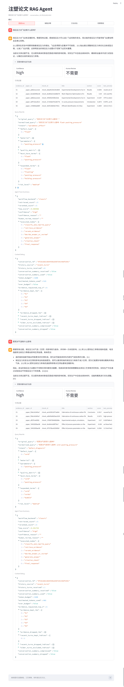

该截图展示普通 RAG 问答结果、引用证据表、检索详情、Query Rewrite、Agent 运行摘要和上下文调试信息，体现系统不是直接生成答案，而是基于论文 chunk 证据进行回答。

### 4.2 首页与聊天界面

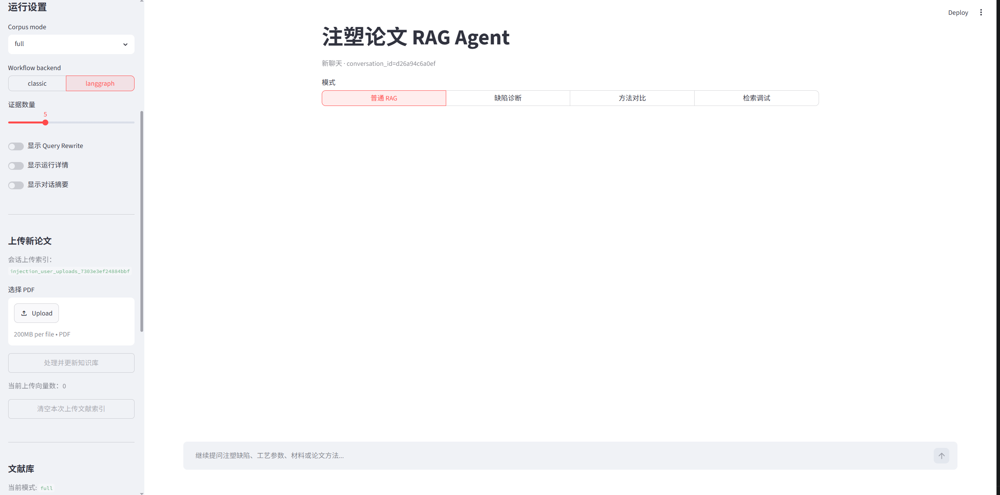

该截图展示 Streamlit 应用首页、聊天输入框、模式切换入口和基础运行界面，说明项目可以在本地正常启动并进行交互式问答。

### 4.3 侧边栏运行状态与文献库信息

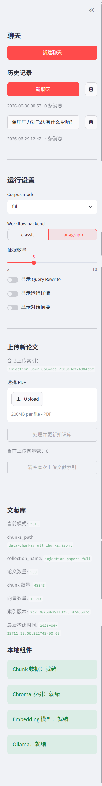

该截图展示运行设置、Corpus mode、Workflow backend、证据数量、上传新论文入口、当前文献库路径、collection name、论文数量、chunk 数量、向量数量和本地组件状态。

### 4.4 缺陷诊断 Agent

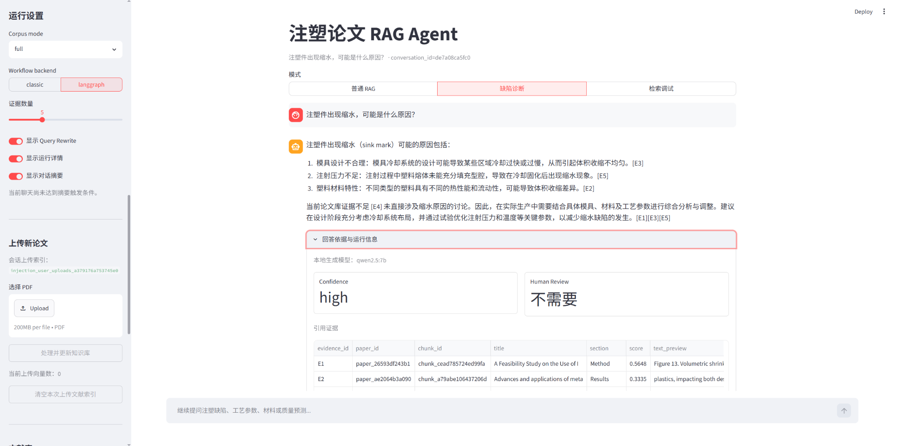

该截图展示缺陷诊断模式下，系统针对“注塑件出现缩水”问题给出可能原因、相关证据、置信度判断和人工复核状态。

### 4.5 PDF 上传与增量索引

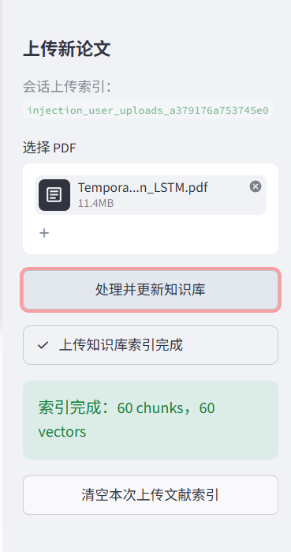

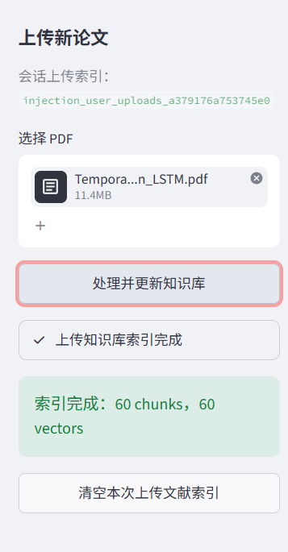

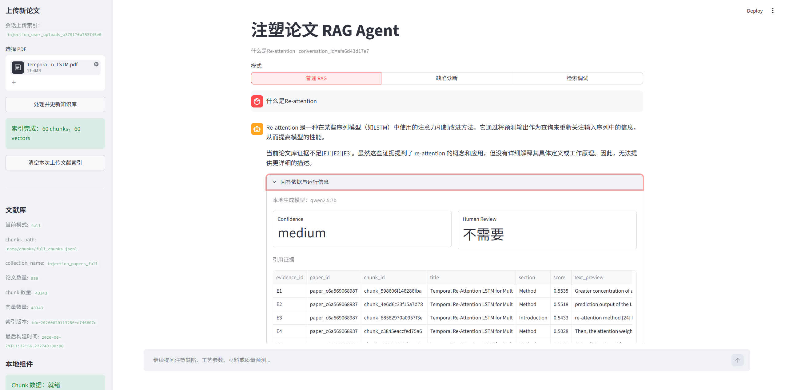

这组三张截图放在一起展示用户上传新论文 PDF 的完整链路：先在侧边栏选择 PDF，再点击“处理并更新知识库”完成会话级 upload collection 索引，最后基于上传文献进行增量问答。上传文献只进入会话上传索引，不污染基础文献库。

---

## 5. 核心功能

### 5.1 论文知识 RAG 问答

系统根据用户问题从论文 chunk 中检索证据，并生成带来源的回答。

示例问题：

```text
注塑件翘曲的主要原因有哪些？
模具温度升高会如何影响透明件质量？
有哪些论文使用机器学习预测注塑产品质量？
```

### 5.2 缺陷诊断辅助

针对常见缺陷，系统检索论文证据，整理可能原因、相关工艺参数、排查方向和风险提示。

覆盖问题包括：

- 翘曲；
- 缩水；
- 熔接痕；
- 短射；
- 飞边；
- 气泡；
- 烧焦；
- 透明件发雾；
- 产品变形严重。

> 注意：系统只提供基于论文证据的候选原因和分析方向，不直接替代现场工程师做最终生产决策。

### 5.3 工艺参数影响分析

支持分析单个工艺参数对质量指标或缺陷的影响。

典型参数：

- 熔体温度；
- 模具温度；
- 注射速度；
- 保压压力；
- 保压时间；
- 冷却时间；
- 背压；
- 螺杆转速。

典型质量指标：

- 产品重量；
- 尺寸精度；
- 透过率；
- 表面质量；
- 翘曲变形；
- 收缩率；
- 内部缺陷。

### 5.4 论文方法对比

支持比较论文中的不同方法：

- 机器学习；
- 深度学习；
- 遗传算法；
- 粒子群优化；
- 贝叶斯优化；
- 知识图谱；
- 仿真优化；
- RAG 与传统 FAQ 系统。

系统会从输入数据、适用场景、优点、局限性和工程落地难度等角度输出对比。

### 5.5 引用证据与人工复核

回答时尽量保留：

- 论文标题；
- chunk 内容；
- 相似度分数；
- rerank 分数；
- 关键证据段落；
- metadata；
- 可能的页码或章节信息。

对于证据不足、证据冲突、生产参数直接调整、质量放行、设备异常、安全风险等问题，系统会提示人工复核，而不是直接给出强结论。

---

## 6. Corpus Mode 设计

项目支持多种语料模式，方便在开发、展示、本地完整运行和公开 Demo 之间切换。

| 模式 | 用途 | 数据规模 | 是否适合 GitHub 仓库 | 说明 |
|---|---|---:|---:|---|
| `dev` | 开发调试 | 约 30 篇 | ✅ 适合 | 速度快，便于调试解析、检索、Prompt |
| `selected` | 小规模精选演示 | 可配置 | ✅ 可放少量样例 | 适合展示核心功能，不追求完整覆盖 |
| `full` | 本地完整效果 | 约 896 篇 | ❌ 不建议直接入库 | 本地私有运行，效果最接近完整论文库 |
| `public_full_release` | 公开 Demo 默认模式 | full 级别产物，不含 PDF | ✅ 通过 Release 分发 | Demo 固定使用该模式，避免普通仓库过大 |

推荐策略：

- **GitHub 普通仓库**：只放代码、配置、文档、少量样例和构建脚本；
- **本地 full 模式**：使用本地 896 篇论文和本地向量库；
- **公开 Demo 模式**：固定使用 `public_full_release`；
- **上传 PDF 功能**：只作为用户增量补充，不作为默认知识库来源。

---

## 7. 技术架构

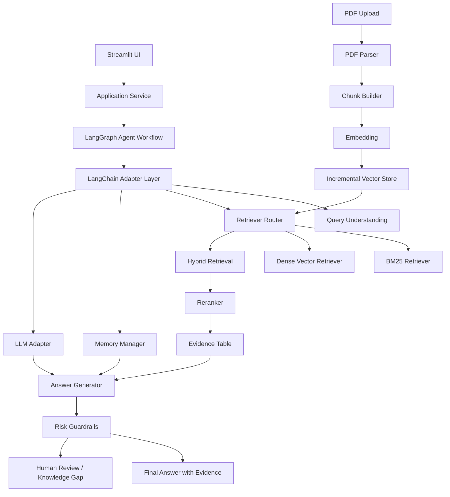

### 7.1 分层说明

| 层级 | 作用 |
|---|---|
| UI 层 | Streamlit 前端，提供问答、模式切换、证据展示、PDF 上传入口 |
| Agent 层 | 使用 LangGraph 编排查询理解、检索、工具调用、风险判断、记忆更新 |
| LangChain Adapter 层 | 统一封装 LLM、Retriever、Prompt、Memory、Output Parser |
| RAG 层 | 负责 chunk 检索、混合召回、rerank、证据表格整理和答案生成 |
| Memory 层 | 管理短期对话记忆、上下文窗口和长对话摘要 |
| Data 层 | 管理 PDF、metadata、chunks、cards、Chroma vector store |
| Guardrail 层 | 处理证据不足、结论冲突、高风险问题和人工复核 |

---

## 8. 数据流

### 8.1 离线知识库构建流程

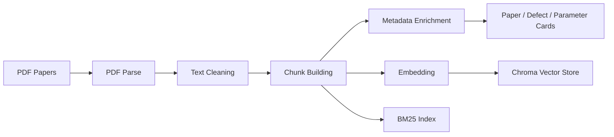

流程说明：

1. 解析 PDF，抽取正文、标题、表格文本、图标题和公式附近文本；
2. 清洗页眉页脚、参考文献噪声和重复内容；
3. 按论文结构构建 chunk，而不是简单固定长度切分；
4. 生成 metadata、paper cards、defect cards、parameter cards；
5. 生成 embedding，并写入 Chroma vector store；
6. 同步构建 BM25 索引，用于关键词召回；
7. 最终形成可用于 RAG / Agent 的本地知识库。

### 8.2 在线问答流程

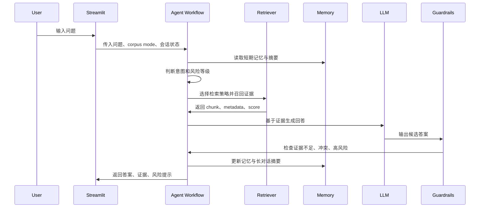

---

## 9. Agent Workflow

项目通过 LangGraph 将 Agent 流程显式建模为状态图，便于调试、扩展和面试展示。

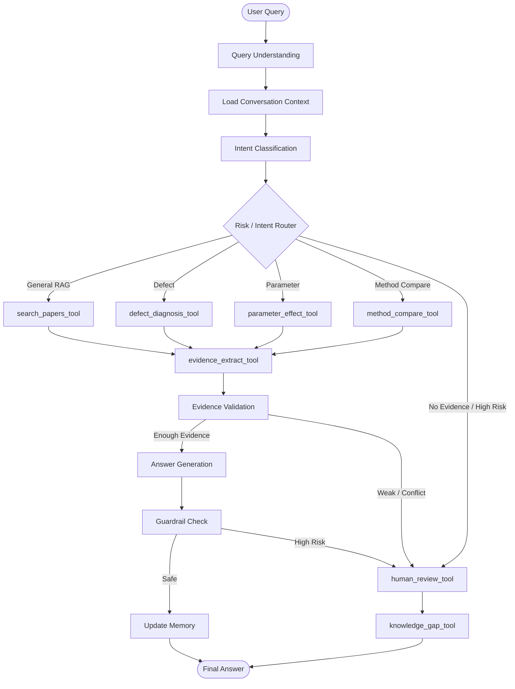

### 9.1 工具列表

| 工具 | 作用 |
|---|---|
| `search_papers_tool` | 按关键词、语义和 metadata 检索论文证据 |
| `defect_diagnosis_tool` | 根据缺陷现象检索可能原因、相关参数和排查方向 |
| `parameter_effect_tool` | 分析某个工艺参数对质量指标或缺陷的影响 |
| `method_compare_tool` | 对比论文中的算法、优化方法或知识组织方法 |
| `evidence_extract_tool` | 将检索结果整理为结构化 evidence table |
| `human_review_tool` | 证据不足、结论冲突、高风险问题时进入人工复核 |
| `knowledge_gap_tool` | 记录论文库没有覆盖的问题，形成后续补库任务 |

---

## 10. Memory 和 Long Context 设计

项目已引入短期对话记忆、上下文管理和长对话摘要，支持更自然的多轮问答。

### 10.1 短期对话记忆

保存最近若干轮用户问题、系统回答、检索证据和关键实体，例如：

```text
用户：注塑件缩水一般和哪些参数有关？
系统：保压压力、保压时间、熔体温度、冷却时间等……
用户：那它对重量有什么影响？
```

第二轮中的“它”需要从上下文中解析为“保压压力 / 保压阶段相关参数”。

### 10.2 上下文管理

系统不会把所有历史对话无脑塞进 prompt，而是按优先级选择上下文：

1. 当前问题；
2. 最近若干轮对话；
3. 当前问题相关的历史摘要；
4. 当前 corpus mode；
5. 本轮检索到的 evidence；
6. 用户上传文献产生的增量证据；
7. 风险提示和人工复核规则。

### 10.3 长对话摘要

当对话变长时，系统将历史内容压缩为结构化摘要：

```yaml
conversation_summary:
  user_goal: "分析注塑件缩水和工艺参数的关系"
  key_entities:
    defects: ["缩水"]
    parameters: ["保压压力", "保压时间", "熔体温度"]
    materials: ["未指定"]
  confirmed_findings:
    - "保压压力通常与缩水和重量变化有关，但需要结合材料和模具结构判断。"
  unresolved_questions:
    - "用户尚未提供具体材料、制件结构和工艺窗口。"
  risk_level: "medium"
```

### 10.4 Memory 边界

Memory 只用于提升多轮对话体验，不替代论文证据：

- 结论必须优先来自当前检索证据；
- 记忆中的旧结论不能直接当作新问题证据；
- 上传文献默认作为增量补充，不覆盖 `public_full_release` 主知识库；
- 高风险问题始终需要人工复核。

---

## 11. 文献上传与增量索引

项目已支持用户在界面上传新的注塑论文 PDF，并实时完成解析、chunk、embedding 和会话级增量索引。

### 11.1 上传流程

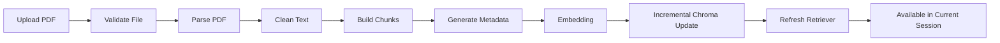

### 11.2 增量索引设计

上传文献不会直接混入默认主知识库，而是写入独立 namespace 或 collection，例如：

```text
vector_store/
├── public_full_release/     # 公开 Demo 默认知识库
├── full/                    # 本地 full 知识库
└── user_uploads/            # 用户上传增量文献
```

检索时可配置：

| 检索范围 | 说明 |
|---|---|
| `base_only` | 只检索当前 corpus mode 对应的基础知识库 |
| `uploads_only` | 只检索用户上传文献 |
| `base_plus_uploads` | 同时检索基础知识库和上传文献 |
| `selected_uploads` | 只检索用户指定的上传文献 |

### 11.3 上传文献的工程约束

- 校验文件类型、大小和页数；
- 使用文件 hash 做去重；
- 解析失败时返回错误原因；
- embedding 失败时不污染主向量库；
- 上传文献只在用户明确选择时参与检索；
- 公开 Demo 中上传功能只作为增量补充，不作为默认知识库来源。

---

## 12. 本地 full 模式运行步骤

本地 full 模式用于运行最完整效果，适合作者本机或企业内部环境。

### 12.1 克隆项目

```bash
git clone https://github.com/<owner>/<repo>.git
cd injection-molding-rag-agent
```

### 12.2 创建环境

推荐 Python 3.10 或 3.11。

```bash
conda create -n molding-rag python=3.10 -y
conda activate molding-rag
pip install -r requirements.txt
```

也可以使用 venv：

```bash
python -m venv .venv
.venv\Scripts\activate
pip install -r requirements.txt
```

### 12.3 检查环境

```bash
python scripts/check_env.py
```

### 12.4 准备本地模型

默认可使用 Ollama 本地大模型：

```bash
ollama pull qwen2.5
```

Embedding 模型可根据配置选择 BGE / sentence-transformers 系列模型。

### 12.5 准备 full 语料

将本地 896 篇论文放入本地数据目录，例如：

```text
data/
├── papers_full/             # 本地 896 篇 PDF，不提交 GitHub
├── processed_full/
├── chunks_full/
└── vector_store_full/
```

### 12.6 设置 corpus mode

在配置文件中设置：

```yaml
corpus:
  mode: full
  paths:
    full:
      papers_dir: data/papers_full
      chunks_dir: data/chunks_full
      metadata_dir: data/metadata_full
      vector_store_dir: data/vector_store_full
```

也可以通过环境变量切换：

```bash
set CORPUS_MODE=full
```

macOS / Linux：

```bash
export CORPUS_MODE=full
```

### 12.7 构建 full 知识库

```bash
python scripts/parse_papers.py --corpus_mode full
python scripts/build_chunks.py --corpus_mode full
python scripts/build_index.py --corpus_mode full
```

如果已经有本地 full 向量库，可以跳过构建步骤，直接配置路径。

### 12.8 启动应用

```bash
streamlit run app/streamlit_app.py
```

访问：

```text
http://localhost:8501
```

---

## 13. Public Demo 模式运行步骤

公开 Demo 默认使用 `public_full_release`，保证展示效果尽量接近 full 本地库，同时不在普通 Git 仓库中直接包含 PDF 原文和完整大体积向量库。

### 13.1 克隆代码仓库

```bash
git clone https://github.com/<owner>/<repo>.git
cd injection-molding-rag-agent
```

### 13.2 安装依赖

```bash
conda create -n molding-rag python=3.10 -y
conda activate molding-rag
pip install -r requirements.txt
```

### 13.3 下载 full_release_no_pdf_v1

从 GitHub Release 下载：

```text
full_release_no_pdf_v1
```

该数据包不包含 PDF 原文，只包含公开 Demo 所需的解析产物、结构化卡片和向量库。

推荐解压目录：

```text
data/public_full_release/
├── full_chunks/
├── metadata/
├── paper_cards/
├── defect_cards/
├── parameter_cards/
├── vector_store/
├── manifest.json
└── README_RELEASE.md
```

如果项目提供下载脚本，可使用：

```bash
python scripts/download_release_artifact.py \
  --release_tag full_release_no_pdf_v1 \
  --output_dir data/public_full_release
```

### 13.4 设置 public_full_release 模式

```yaml
corpus:
  mode: public_full_release
  paths:
    public_full_release:
      chunks_dir: data/public_full_release/full_chunks
      metadata_dir: data/public_full_release/metadata
      paper_cards_dir: data/public_full_release/paper_cards
      defect_cards_dir: data/public_full_release/defect_cards
      parameter_cards_dir: data/public_full_release/parameter_cards
      vector_store_dir: data/public_full_release/vector_store
```

或通过环境变量：

```bash
set CORPUS_MODE=public_full_release
```

macOS / Linux：

```bash
export CORPUS_MODE=public_full_release
```

### 13.5 启动公开 Demo

```bash
streamlit run app/streamlit_app.py
```

公开 Demo 中：

- 默认知识库固定为 `public_full_release`；
- 用户上传 PDF 只作为增量补充；
- 上传内容不会替代默认知识库；
- 系统回答仍需要基于检索证据，并保留风险提示。

---

## 14. GitHub Release 数据分发说明

### 14.1 为什么普通 GitHub 仓库只放代码

普通 Git 仓库不适合直接放入大体积 PDF、chunks 和完整 vector store，原因包括：

1. **仓库体积膨胀**：大文件会让 clone、pull、CI 都变慢；
2. **Git 历史难清理**：一旦大文件进入历史记录，即使删除也会继续占用仓库历史空间；
3. **协作成本高**：频繁更新向量库会导致大量二进制文件变化；
4. **版权说明复杂**：论文 PDF 原文公开再分发需要逐篇确认授权；
5. **工程边界更清晰**：代码版本和数据制品版本应该解耦管理。

因此，GitHub 仓库本体只保留：

- 源代码；
- 配置文件；
- 项目文档；
- 少量公开样例；
- 评测样例；
- 构建与下载脚本；
- `.env.example` 和 `.gitignore`。

### 14.2 为什么使用 GitHub Release 分发 full artifact

GitHub Release 更适合发布与代码版本绑定的大体积制品：

- 可以按 tag 管理数据版本；
- 不污染 Git commit 历史；
- 便于用户下载固定版本；
- 可以提供 manifest、checksum 和 release note；
- 适合作为公开 Demo 的数据入口。

### 14.3 full_release_no_pdf_v1 包含什么

`full_release_no_pdf_v1` 已按公开 Demo 方案整理，包含：

```text
full_release_no_pdf_v1/
├── full_chunks/             # 由 full 896 篇文献解析得到的 chunk
├── metadata/                # 论文标题、作者、年份、来源、chunk 映射等元数据
├── paper_cards/             # 论文级结构化卡片
├── defect_cards/            # 缺陷相关知识卡片
├── parameter_cards/         # 工艺参数相关知识卡片
├── vector_store/            # Chroma vector store
├── manifest.json            # 文件清单、版本、hash、构建信息
├── checksums.sha256         # 校验文件
└── README_RELEASE.md        # 数据包说明
```

### 14.4 为什么不放 PDF 原文

本次公开主线不直接发布 PDF 原文，主要原因：

1. **体积大**：896 篇 PDF 会显著增加下载和存储成本；
2. **clone 慢**：如果放入普通仓库，会严重影响使用体验；
3. **版权说明复杂**：论文原文是否可再分发需要逐篇确认；
4. **Demo 不强依赖 PDF 原文**：RAG 问答主要依赖 chunks、metadata 和 vector store；
5. **公开边界清晰**：先公开无 PDF 的 full artifact，更适合作为求职展示和功能演示。

换句话说，`public_full_release` 的目标不是重新分发论文原文，而是让公开 Demo 尽量接近本地 full 知识库的检索和问答效果。

---

## 15. RAG / Agent 亮点

### 15.1 面向论文库，而不是普通 FAQ

系统处理的是论文 PDF、metadata、chunk、结构化卡片和向量库，而不是手写问答对。因此更强调证据检索、来源追溯和论文方法对比。

### 15.2 支持多 corpus mode

通过 `dev` / `selected` / `full` / `public_full_release` 切换，兼顾开发速度、本地完整效果和公开 Demo 可用性。

### 15.3 Hybrid Retrieval + Rerank

BM25 适合缺陷名、参数名、材料名等精确术语；Dense Retrieval 适合语义相近问题；Rerank 用于提高最终证据排序质量。

### 15.4 LangChain Adapter

将 LLM、Retriever、Prompt、Output Parser、Memory 等模块封装为可替换组件，方便后续切换本地模型、云模型或不同向量库。

### 15.5 LangGraph Workflow

使用显式状态图管理 Agent 流程，便于展示每一步如何完成：

- 问题理解；
- 意图识别；
- 检索策略选择；
- 工具调用；
- 证据整理；
- 风险判断；
- 答案生成；
- 记忆更新；
- 人工复核。

### 15.6 Memory 和 Long Context

支持短期对话记忆、上下文压缩和长对话摘要，让系统能处理“上一条提到的参数”“刚才那种缺陷”等多轮追问。

### 15.7 用户上传 PDF 增量索引

用户可以上传新论文，系统实时解析并增量写入向量库，适合企业持续补充内部文献。

### 15.8 工业场景 Guardrails

对于高风险问题，系统不直接给生产结论，而是提示证据不足、结论冲突或建议人工复核。

---

## 16. 使用边界与免责声明

本项目用于注塑论文知识检索、研发辅助分析和求职项目展示，不应直接替代企业现场工程师、质量工程师或设备工程师的判断。

以下场景必须人工复核：

- 批量生产参数调整；
- 产品质量放行；
- 安全风险判断；
- 设备异常诊断；
- 法规标准判断；
- 高价值模具或材料试产；
- 证据不足或论文结论冲突的情况。

系统输出应理解为“基于论文证据的分析方向”，而不是最终生产决策。

---

## 17. 示例问题

### 17.1 RAG 问答

```text
注塑成型中熔体温度对产品质量有什么影响？
哪些论文研究了注塑产品重量预测？
注塑过程中模具温度升高通常会带来哪些质量变化？
```

### 17.2 缺陷诊断

```text
注塑件出现翘曲，可能是什么原因？
缩水咋办？
透明件发雾可能和哪些工艺参数有关？
产品变形严重，论文中有哪些常见解释？
```

### 17.3 工艺参数影响

```text
保压压力对缩水和产品重量有什么影响？
冷却时间会如何影响尺寸精度？
注射速度过快可能导致哪些缺陷？
```

### 17.4 方法对比

```text
机器学习和深度学习在注塑质量预测中的区别是什么？
遗传算法和粒子群优化在注塑参数优化中有什么不同？
知识图谱方法相比传统 RAG 有什么优势和局限？
```

### 17.5 无答案与低置信度问题

```text
某一种特殊进口材料的最佳注塑参数是多少？
能不能直接给我一组可用于量产的参数？
这个产品能不能质量放行？
```

对于这类问题，系统应提示证据不足或建议人工复核，而不是直接给出高风险结论。

---

## 18. 推荐项目目录

```text
injection-molding-rag-agent/
├── app/
│   ├── streamlit_app.py
│   ├── pages/
│   └── components/
│
├── src/
│   ├── config/
│   ├── data/
│   ├── parsing/
│   ├── chunking/
│   ├── embeddings/
│   ├── vectorstore/
│   ├── retrieval/
│   ├── rerank/
│   ├── rag/
│   ├── memory/
│   ├── langchain_adapter/
│   ├── langgraph_workflow/
│   ├── agents/
│   ├── tools/
│   ├── evaluation/
│   └── utils/
│
├── configs/
│   ├── app_config.yaml
│   ├── model_config.yaml
│   ├── retrieval_config.yaml
│   └── corpus_config.yaml
│
├── data/
│   ├── samples/
│   ├── eval/
│   └── README.md
│
├── docs/
│   ├── project_design.md
│   ├── agent_tool_design.md
│   ├── multimodal_design.md
│   ├── public_full_release_strategy.md
│   └── assets/
│
├── scripts/
│   ├── check_env.py
│   ├── parse_papers.py
│   ├── build_chunks.py
│   ├── build_index.py
│   ├── download_release_artifact.py
│   └── run_eval.py
│
├── tests/
│   ├── test_retrieval.py
│   ├── test_rag.py
│   ├── test_memory.py
│   └── test_tools.py
│
├── requirements.txt
├── README.md
├── LICENSE
├── .env.example
└── .gitignore
```

---

## 19. 已完成事项与后续扩展方向

本节原本记录的是工程化待办事项。当前这些内容已按照“注塑企业论文知识库 Agent”升级手册完成实现，因此这里改为阶段完成清单，并保留后续可继续增强的方向。

### 19.1 工程功能

- [x] 完成 corpus mode 配置统一；
- [x] 完成 `public_full_release` 下载与自动校验脚本；
- [x] 完成用户上传 PDF 的增量索引；
- [x] 完成多 collection / namespace 检索；
- [x] 完成 evidence table 可视化；
- [x] 增加检索调试页面。

### 19.2 Agent 能力

- [x] 接入 LangChain adapter；
- [x] 使用 LangGraph 重构 Agent workflow；
- [x] 增加短期对话记忆；
- [x] 增加长对话摘要；
- [x] 增加风险判断节点；
- [x] 增加知识缺口记录。

### 19.3 数据与评测

- [x] 从 dev 30 篇切换到 full 896 篇本地文献库；
- [x] 发布 `full_release_no_pdf_v1`；
- [x] 完善评测问题集；
- [x] 评估检索命中率、回答忠实度、拒答能力和高风险识别能力；
- [x] 补充更多公开样例问题和 Demo 截图。

### 19.4 多模态扩展

- [x] 增强论文表格解析；
- [x] 处理图标题和图附近段落；
- [x] 提取公式附近解释文本；
- [x] 尝试缺陷图片识别作为候选缺陷提示；
- [x] 对低置信度识别结果强制人工确认。

### 19.5 后续可继续优化

- 继续补充更多公开可展示样例问题，提升 Demo 覆盖面；
- 继续扩充评测集，区分普通问答、缺陷诊断、参数分析、方法对比和无答案问题；
- 继续优化 rerank、证据去重、引用压缩和长对话上下文选择策略；
- 继续完善上传文献的安全校验、解析失败兜底和人工复核流程。

---

## 20. License

代码部分可根据实际情况选择开源协议，例如 MIT License。

论文原文、完整向量库和 full artifact 是否公开，需要根据数据来源、版权和使用许可单独判断。本项目当前公开主线优先发布不含 PDF 原文的 `full_release_no_pdf_v1`。

---

## 21. 致谢

本项目围绕注塑成型论文知识库、工业 RAG、Agent Workflow、本地大模型和制造业知识管理展开，目标是探索大模型技术在真实工业知识场景中的可落地方式。
